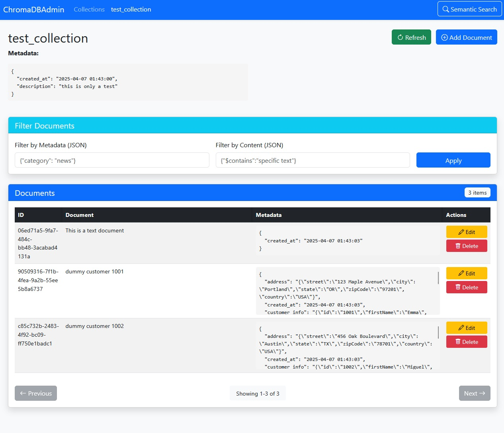

# ChromaDBAdmin

[](https://github.com/j-lag/chromadbadmin/releases)
[](https://github.com/j-lag/chromadbadmin/blob/main/LICENSE)
[](https://www.python.org/downloads/)
[](https://github.com/j-lag/chromadbadmin)
[](https://github.com/j-lag/chromadbadmin/stargazers)


ChromaDBAdmin is a comprehensive web-based administration tool for ChromaDB vector databases. It provides an intuitive interface to manage your ChromaDB collections, documents, and embeddings.

## Features

- **Database Management**: Connect to any ChromaDB persistent database directory
- **Collection Management**: Create, view, edit, and delete collections
- **Document Management**: Add, edit, delete and filter documents in collections
- **Metadata Support**: Full support for metadata on both collections and documents
- **Vector Search**: Perform semantic searches using the OpenAI embedding API
- **Filtering**: Apply filters on metadata and document content
- **Pagination**: Navigate through large collections with ease
- **Embedding Generation**: Automatically generate embeddings using OpenAI API

## Installation

1. Clone this repository:
```bash
git clone https://github.com/yourusername/chromadbadmin.git
cd chromadbadmin
```

2. Create a virtual environment and install dependencies:
```bash
python -m venv venv
source venv/bin/activate  # On Windows: venv\Scripts\activate
pip install -r requirements.txt
```

3. Create a `.env` file with your configuration:
```
SECRET_KEY=your-secret-key
OPENAI_API_KEY=your-openai-api-key
```

## Usage

1. Run the application:
```bash
python app.py
```

2. Open your browser and navigate to `http://127.0.0.1:5000/`

3. On the first run, you'll be prompted to select or create a ChromaDB directory.

## Key Components

- **Flask Web Server**: Provides the web interface and API endpoints
- **ChromaDB Client**: Connects to the underlying vector database
- **Document Manager**: Handles CRUD operations for documents
- **Embedding Service**: Generates embeddings using OpenAI's API
- **Collection Manager**: Manages ChromaDB collections

## Filtering Capabilities

ChromaDBAdmin provides powerful filtering options that map directly to ChromaDB's query capabilities:

### Metadata Filtering

Metadata filtering allows you to search documents based on their associated structured metadata:

```json
{"category": "report", "author": "john.smith"}
```

This will return only documents that have BOTH conditions satisfied in their metadata.

You can use special operators for more complex queries:

- Comparison operators: `$gt` (greater than), `$gte` (greater than or equal), `$lt` (less than), `$lte` (less than or equal)
  ```json
  {"timestamp": {"$gte": "2023-01-01", "$lt": "2023-02-01"}}
  ```

- `$ne` (not equal)
  ```json
  {"status": {"$ne": "archived"}}
  ```

- `$in` (in array of values)
  ```json
  {"category": {"$in": ["news", "blog", "article"]}}
  ```

- `$nin` (not in array)
  ```json
  {"category": {"$nin": ["draft", "private"]}}
  ```

### Document Content Filtering

Document content filtering searches within the text content of documents:

```json
{"$contains": "artificial intelligence"}
```

This will return documents where the content contains the phrase "artificial intelligence".

The document filtering uses the `$contains` operator which performs substring matching within the document text. This is useful for finding specific terms, phrases, or patterns in your document content regardless of metadata.

### Combining Filters

You can use both metadata and document content filters simultaneously for more targeted queries. For example, filtering for documents that:
- Have "report" as their category (metadata)
- Were created in January 2023 (metadata)
- Contain the phrase "quarterly results" (document content)

### Use Cases

- **Metadata filtering**: Best for structured data like dates, categories, authors, status flags
- **Document content filtering**: Best for full-text search, finding specific terms or phrases
- **Combined filtering**: Use for precise queries that need both metadata and content criteria

Note that for more complex semantic searches, you should use the "Semantic Search" feature instead, which utilizes embeddings to find semantically similar content rather than exact text matches.

## Screenshots

Here's a preview of the ChromaDBAdmin interface:



## API Endpoints

The application exposes several REST API endpoints that can be used programmatically:

- `/collections` - List all collections
- `/collection/create` - Create a new collection
- `/collection/<name>/delete` - Delete a collection
- `/collection/<name>/documents` - Get documents in a collection
- `/collection/<name>/document/add` - Add a document
- `/collection/<name>/document/<id>/update` - Update a document
- `/collection/<name>/document/<id>/delete` - Delete a document
- `/collection/<name>/query` - Perform semantic search
- `/get_embedding` - Generate an embedding for text

## Requirements

- Python 3.8+
- ChromaDB
- Flask
- OpenAI API (for embeddings)

## Extending

The application has a modular design that makes it easy to extend:

- Add new embeddings providers in `modules/embedding.py`
- Add new document processors in `modules/document_manager.py`
- Extend the UI by modifying the templates in the `templates/` directory

## License

MIT

## Contributing

Contributions are welcome! Please feel free to submit a Pull Request.
